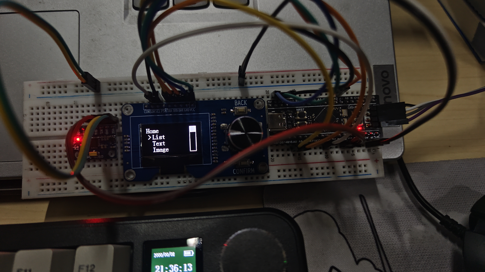

# Menu_by_LinkLst
通过链表实现的菜单栏 
**MCU:** STM32F411CEU6 
**Driver:** 使用[keysking的OLED驱动](https://www.bilibili.com/video/BV19u4y197df/?spm_id_from=333.788&vd_source=20fa110c504d76c11b6f792060c531d7) 
**效果如下:** 
 

